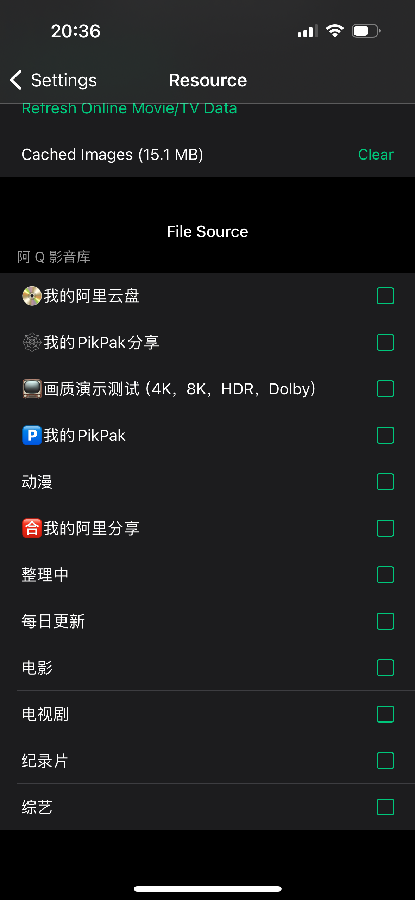
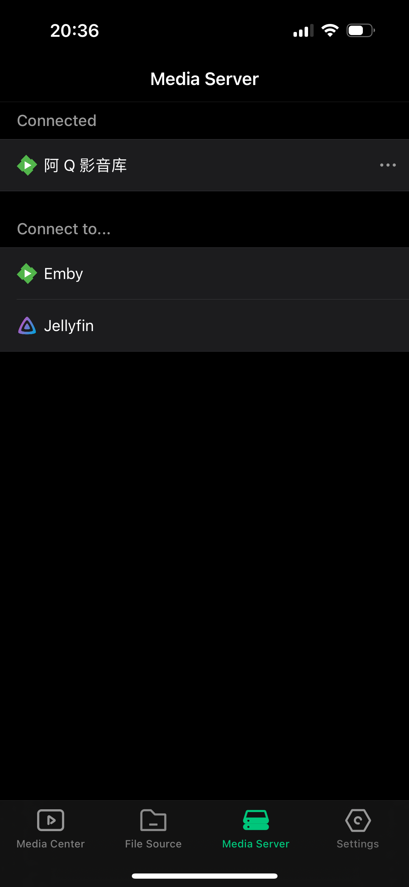
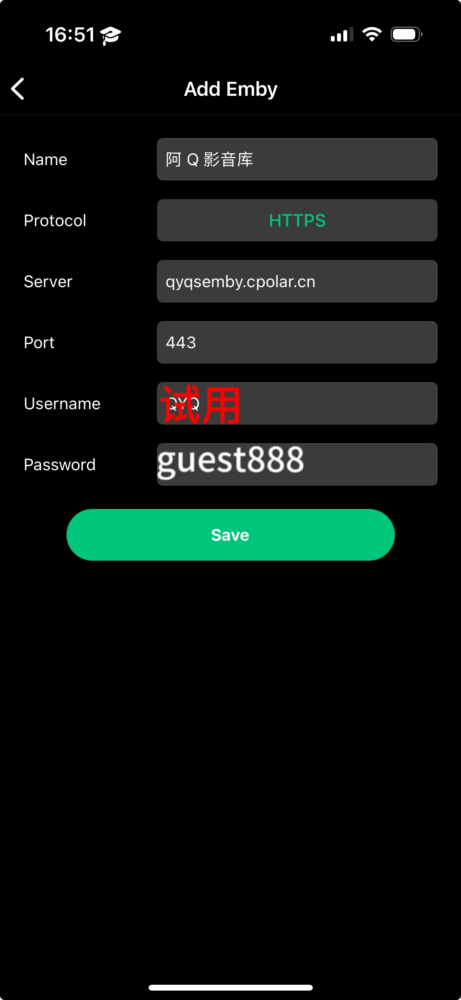

# 阿 Q 云端影音库设置教程

## TL;DR

### 发布地址

- Emby: qyqsemby.cpolar.cn
- xiaoya: sbaliyun.cpolar.cn
- AList: qyqalist.cpolar.cn

### WebDAV 设置

- xiaoya: 主机为发布地址，端口80，账号dav，密码咨询管理员。(可用PotPlayer和VidHub连接，如使用VidHub**请务必关闭资源库扫描**，如下图)
  进入*设置->资源*取消所有☑️

- Emby：https://qyqsemby.cpolar.cn，联系管理员创建账号。
- TVBox: 订阅地址咨询管理员。

## 详细设置

### 桌面端

#### Windows

下载[Emby Theater](https://emby.media/support/articles/Emby-Theater-for-Windows.html)连接Emby服务器观看。

#### Mac

下载VidHub连接Emby服务器观看。

### 移动端

iOS和安卓都推荐使用VidHub连接Emby观看。

打开软件进入媒体库

然后选择Emby，根据下图输入服务器地址和账号密码

### TV

TV端观影方案有两套：

1. 下载Emby电视端连接服务器观看。
2. 下载TVBox（咨询管理员）订阅阿 Q 影音库进行观看。

## 加入交流群获取更多信息

